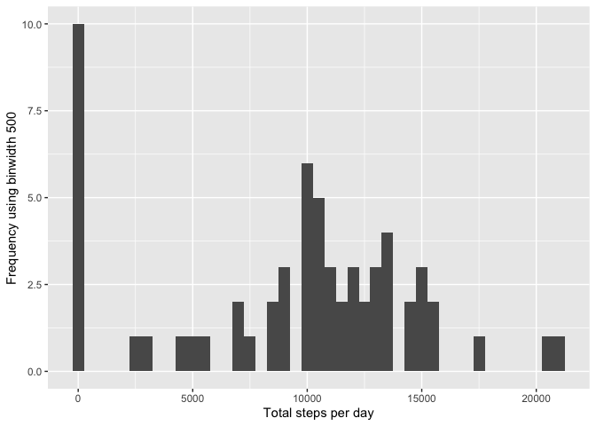
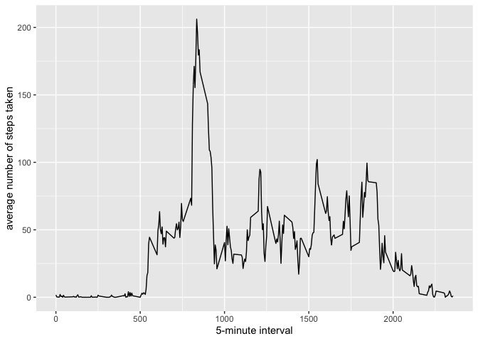
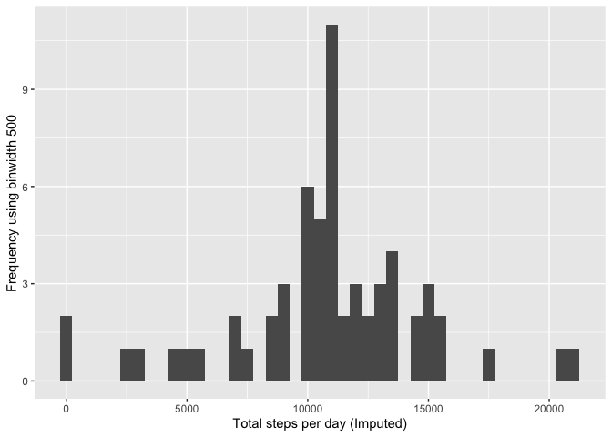
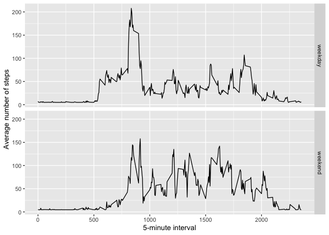

## Loading and preprocessing the data

## What is mean total number of steps taken per day?

```r
# activityData <- select(activity, date, steps)
# activityData <- group_by(activity, date)
# activityData <- summarise(activity, tsteps= sum(steps))
# na.omit(activityData)
# hist(activityData$tsteps, xlab = "Total daily Steps", main = "Histogram of Total Steps by day", breaks = 20)
```

```r
activityData <- tapply(activity$steps, activity$date, sum, na.rm=TRUE)
qplot(activityData, xlab='Total steps per day', ylab='Frequency using binwidth 500', binwidth=500)
```

<!-- -->

```r
mean(activityData)
```

```
## [1] 9354.23
```

```r
median(activityData)
```

```
## [1] 10395
```


## What is the average daily activity pattern?

```r
averageSteps <- aggregate(x=list(meanSteps=activity$steps), by=list(interval=activity$interval), FUN=mean, na.rm=TRUE)
ggplot(data=averageSteps, aes(x=interval, y=meanSteps)) + geom_line() + xlab("5-minute interval") +
    ylab("average number of steps taken") 
```

<!-- -->

```r
mostSteps <- which.max(averageSteps$meanSteps)
timeMostSteps <-  gsub("([0-9]{1,2})([0-9]{2})", "\\1:\\2", averageSteps[mostSteps,'interval'])
timeMostSteps
```

```
## [1] "8:35"
```


## Imputing missing values

```r
missingVal <- length(which(is.na(activity$steps)))
missingVal
```

```
## [1] 2304
```

```r
activityImputed <- activity
activityImputed$steps <- impute(activity$steps, fun=mean)
stepsImputed <- tapply(activityImputed$steps, activityImputed$date, sum)
qplot(stepsImputed, xlab='Total steps per day (Imputed)', ylab='Frequency using binwidth 500', binwidth=500)
```

<!-- -->

```r
stepsMeanImputed <- mean(stepsImputed)
stepsMedianImputed <- median(stepsImputed)
stepsMeanImputed
```

```
## [1] 10766.19
```

```r
stepsMedianImputed
```

```
## [1] 10766.19
```


## Are there differences in activity patterns between weekdays and weekends?


```r
activityImputed$dateType <-  ifelse(as.POSIXlt(activityImputed$date)$wday %in% c(0,6), 'weekend', 'weekday')
averagedActivityImputed <- aggregate(steps ~ interval + dateType, data=activityImputed, mean)
ggplot(averagedActivityImputed, aes(interval, steps)) + geom_line() + facet_grid(dateType ~ .) + 
    xlab("5-minute interval") + ylab("Average number of steps")
```

<!-- -->

